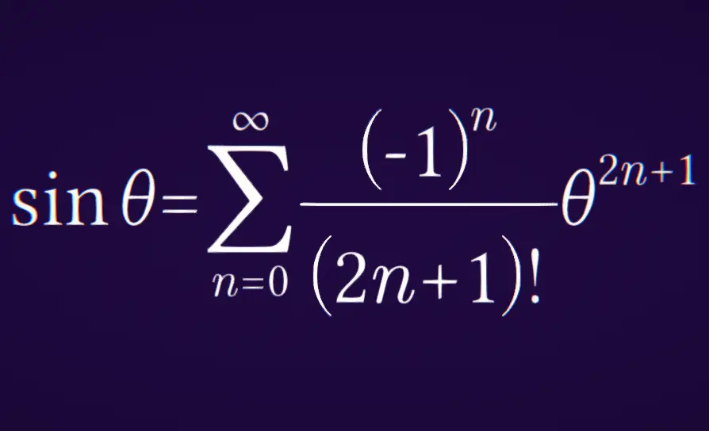

# MathExpressionRenderer

A tool inspired mostly by LaTeX, which formats mathematical expressions entered as plain text by the user.
Made using Unity.

[[Demo on Unity Play]](https://play.unity.com/fr/games/443a813f-620f-4286-a2c4-cc5356ec833e/mathematical-expression-renderer)

